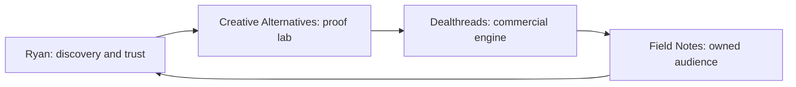

# The Ryan media brand system map

> [!warning] Evidence label
> **Evidence-backed framing.** Use only the evidence listed below and preserve the stated limitations.

## Screen-Ready Brand System

| Layer | Job |
| --- | --- |
| Ryan | Earn attention by documenting the work |
| Creative Alternatives | Supply real business problems and artifacts |
| Dealthreads | Convert revenue-system demand into a concrete offer |
| Field Notes | Turn rented reach into an owned audience |

## On-Camera Line

“What I am showing you is the Ryan media brand system map. The important part is the sequence, the owner, and the evidence we still need.”

## Evidence Lock

- Creative Alternatives reports roughly $3.2M in annual revenue

## Screen Direction

1. Open this note in Obsidian Reading View.
2. Start with the title and evidence label visible.
3. Scroll to or zoom into the screen-ready section.
4. Hide sidebars before recording.
