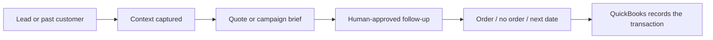

# A customer journey from lead to reorder

> [!warning] Evidence label
> **Evidence-backed framing.** Use only the evidence listed below and preserve the stated limitations.

## Screen-Ready Customer Journey

**Point:** QuickBooks remains the accounting record. The operating system owns the stages and next actions around it.

## On-Camera Line

“What I am showing you is a customer journey from lead to reorder. The important part is the sequence, the owner, and the evidence we still need.”

## Evidence Lock

- Creative Alternatives currently uses QuickBooks as its primary system

## Screen Direction

1. Open this note in Obsidian Reading View.
2. Start with the title and evidence label visible.
3. Scroll to or zoom into the screen-ready section.
4. Hide sidebars before recording.
