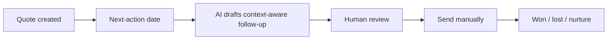

# A quote-to-follow-up workflow

> [!warning] Evidence label
> **Concept / sample - not a completed result.** This visual explains the proposed workflow. Do not call it a deployed system or customer result.

## Screen-Ready Quote Follow-Up Workflow

| Required field | Example |
| --- | --- |
| Quote status | Waiting on customer |
| Business reason | Employee appreciation event |
| Next action | Confirm quantity and delivery date |
| Owner | Account manager |

## On-Camera Line

“What I am showing you is a quote-to-follow-up workflow. The important part is the sequence, the owner, and the evidence we still need.”

## Evidence Lock

- No numerical performance claim is attached to this artifact.

## Screen Direction

1. Open this note in Obsidian Reading View.
2. Start with the title and evidence label visible.
3. Scroll to or zoom into the screen-ready section.
4. Hide sidebars before recording.
