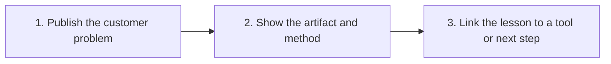

# Campaign-to-content pipeline

> [!warning] Evidence label
> **Concept / sample - not a completed result.** This visual explains the proposed workflow. Do not call it a deployed system or customer result.

## Screen-Ready View

| Step | Operator decision |
| ---: | --- |
| 1 | Publish the customer problem |
| 2 | Show the artifact and method |
| 3 | Link the lesson to a tool or next step |

**Business CTA:** Read Revenue System Field Notes.

## On-Camera Line

“What I am showing you is campaign-to-content pipeline. The important part is the sequence, the owner, and the evidence we still need.”

## Evidence Lock

- No numerical performance claim is attached to this artifact.

## Screen Direction

1. Open this note in Obsidian Reading View.
2. Start with the title and evidence label visible.
3. Scroll to or zoom into the screen-ready section.
4. Hide sidebars before recording.
