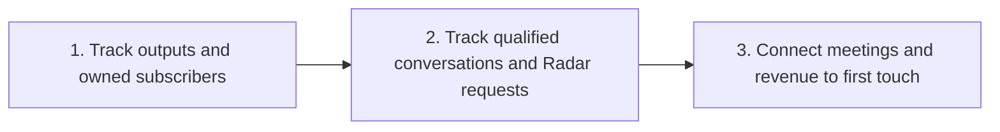

# The media-to-revenue scorecard

> [!warning] Evidence label
> **Concept / sample - not a completed result.** This visual explains the proposed workflow. Do not call it a deployed system or customer result.

## Screen-Ready View

| Step | Operator decision |
| ---: | --- |
| 1 | Track outputs and owned subscribers |
| 2 | Track qualified conversations and Radar requests |
| 3 | Connect meetings and revenue to first touch |

**Business CTA:** Use the free calculator to model your economics.

## On-Camera Line

“What I am showing you is the media-to-revenue scorecard. The important part is the sequence, the owner, and the evidence we still need.”

## Evidence Lock

- No numerical performance claim is attached to this artifact.

## Screen Direction

1. Open this note in Obsidian Reading View.
2. Start with the title and evidence label visible.
3. Scroll to or zoom into the screen-ready section.
4. Hide sidebars before recording.
